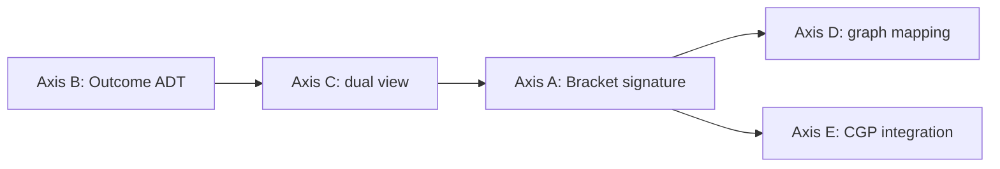

# ADR-0001 — Bracket trait と Outcome ADT の最初の議事録

> **Status**: `proposed` (= 議論の入口、 具体 signature は後続 ADR で決定)
> **Date**: 2026-05-16
> **Deciders**: mito (with claude Opus 4.7 as conversation partner)
> **Supersedes**: ──
> **Related**: [[nostos-founding-decision]] (creo-memories `mem_1Cb35YiGHG1f7UdXyyt16L`)

---

## Context

`nostos` の **technical scope** は [founding decision](https://github.com/chronista-club/club-nostos/blob/main/README.md#scope) で 5 項目に framing されました。 そのうちの core 2 つ ── **bracket primitive** と **Outcome ADT** ── が library の foundation です。 その他 3 項目 (lifecycle ↔ loop dual / graph 同型 / CGP composition) は core 2 つの上に lift されます。

本 ADR は **「最初の議事録」** として、 具体的な型 signature を決めるのではなく、 **判断すべき axes を framing** することを目的とします。 specific signature 選定は後続 ADR (0002〜) で個別に深掘りします。

## Goal of this ADR

- 5 つの設計 axes を identify する
- それぞれの axis で 「現時点での暫定的な傾き」 を記録する
- どの axis が **先に深掘りされるべきか** の priority を提案する

非目標: 型 signature の確定、 実装着手。

## 設計 axes

### Axis A — Bracket trait の signature 形

```text
?  trait Bracket {
?      type Input;
?      type Active<'a>;       // GAT?
?      type Outcome;
?      fn enter(self, input: Self::Input) -> Self::Active<'_>;
?      fn exit(active: Self::Active<'_>) -> Self::Outcome;
?  }
```

**問い:**
- `Active` 型は GAT (Generic Associated Types) で lifetime 付き? それとも owned only?
- `enter` は `self` を consume するか、 `&mut self` で reusable か?
- `exit` は free function か trait method か?

**暫定的な傾き**: GAT 採択 + `self` consume が表現力高い。 ただし API 学習コストとの trade-off。

### Axis B — Outcome ADT の variant 集合

```rust
pub enum Outcome<O, I, E> {
    Done(O),
    Reborn(I),
    Fail(E),
}
```

**問い:**
- 3 variant で **過不足ないか**? 例: `Pending` / `Cancelled` / `Suspended` は別 variant か別 ADT か?
- generic type parameter は 3 つで適切か? `O = I` のとき特殊化 helper を用意するか?
- `Result<O, E>` との **convert path** を提供するか? (`From` 実装 / 専用 method)

**暫定的な傾き**: 3 variant で start、 拡張は extension trait で行う。 `Result` との相互運用は **第一級** で提供。

### Axis C — lifecycle ↔ loop dual の表現

「単発 lifecycle」 と 「反復 loop」 を同一 substrate で扱う設計の表現:

- **Option α**: 別 trait `Lifecycle` / `Loop` を用意、 `From<Lifecycle>` で loop 化
- **Option β**: 同 trait `Bracket` に `iter()` adapter を用意
- **Option γ**: `Outcome::Reborn` variant が次回入力を返す自己再帰として表現

**暫定的な傾き**: γ が most elegant。 `Reborn(I)` が文字通り 「次の生」 を意味する ── nostos の語源 (= 帰還) と最も整合。

### Axis D — node graph editor との同型 substrate

visual programming back-end として、 graph node の interface と Bracket trait が **直接 mapping** できるか:

- node = bracket instance、 input port = `Active` enter point、 output port = `Outcome` variant の分岐
- ただし graph editor 側の **dynamic dispatch** 要件と、 Rust trait の **static dispatch** 要件の橋渡しが必要 (`Box<dyn Bracket>` パターン or 専用 `BracketObject` trait)

**問い:**
- graph editor 側 (= vantage-point Canvas 想定) の API と nostos trait の **接合面** をいつ deepen するか?
- core crate に dyn-safe wrapper を入れるか別 crate (= `nostos-graph`) に切るか?

**暫定的な傾き**: founding 段階では深追り不要。 別 crate 化が筋。

### Axis E — CGP-style component composition との関係

`cgp` crate (Context-Generic Programming、 unison v0.10.1 で v0.7.0 採用) との integration:

- nostos primitive を CGP component として **expose** するか?
- もしくは CGP は **consumer 側の dependency** に留めるか?

**暫定的な傾き**: nostos core は **CGP に非依存**。 別 crate (= `nostos-cgp`) で integration を提供する形が分離度高い。

## 提案する深掘り順序



**根拠**: Outcome ADT が **最小単位 (= 単なる enum)** で、 ここを fix すると Axis C (= Reborn variant で loop 表現するか) が決まり、 そこから Bracket trait の `Outcome` 関連型が連動して決まる。 D / E は core が固まってから別軸で進める。

## Consequences

### Positive

- 「具体 signature を決めずに着手する」 ことで、 ADR が **過剰 commit** にならない
- 5 axes を identify したことで、 後続 ADR の **scope が明確** になった
- nostos の **意味論的 core** (= `Reborn` variant が次の生を返す) が language-level に降りる prospect が見えた

### Negative

- `proposed` ステータスのまま長期化すると、 「議論ばかりで実装が進まない」 critique が想定される
- Axis A 暫定傾き (GAT 採択) は学習コスト負荷あり、 後で簡素化が必要になる可能性

### Neutral

- 各 axis は **独立した ADR** に分割される (= ADR-0002 Outcome / ADR-0003 dual view / ADR-0004 Bracket signature / ...)

## Open Questions

1. `Outcome` の variant naming は `Done` / `Reborn` / `Fail` で **fix** か、 別案 (`Returned` / `Retried` / `Crashed` 等) を検討するか?
2. `nostos` lib の **MSRV (= Minimum Supported Rust Version)** は 1.95 で fix か、 GAT 安定化に追従する形で flexible にするか?
3. `no_std` support は initial design に含めるか、 後追いで feature flag 化するか?

---

> 本 ADR は draft 段階。 review と議論を経て `accepted` に昇格させます。
